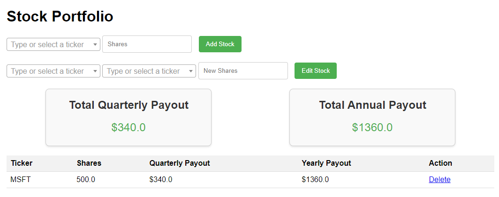

# Dividend Calculator

## Project Description

Dividend Calculator is a Flask-based web application that allows users to manage their stock portfolio and calculate dividend payouts. It provides functionalities to add, delete, and edit stock information and automatically calculates quarterly and yearly dividend payouts.

### Features

- Manage stock portfolio with add, delete, and edit capabilities.
- Calculate and display quarterly and annual dividend payouts.
- Interactive user interface with data validation.

